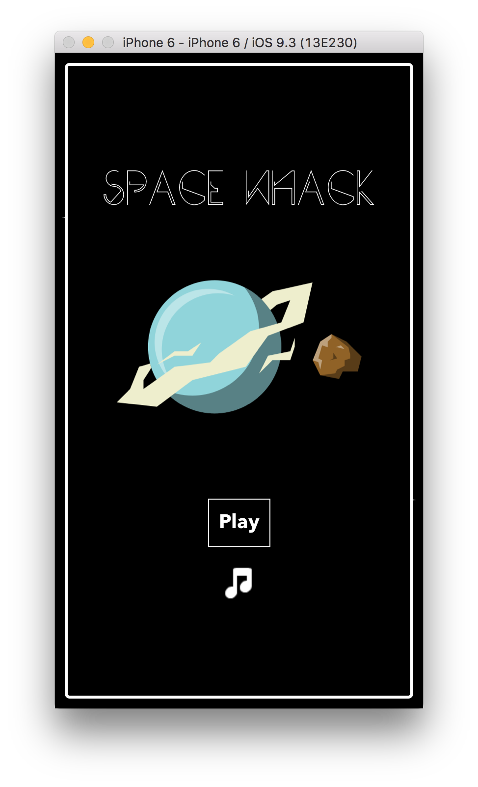
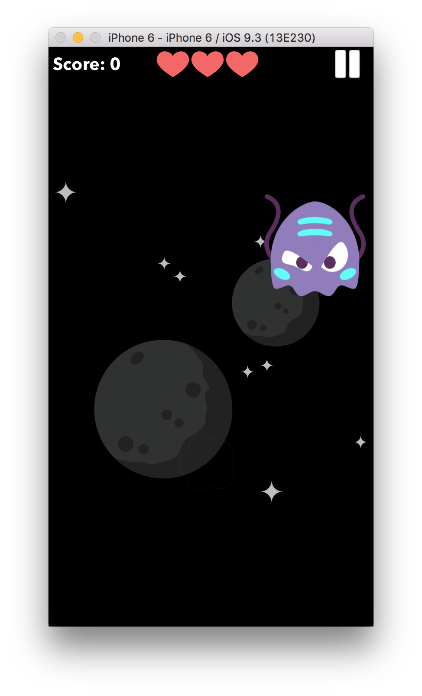
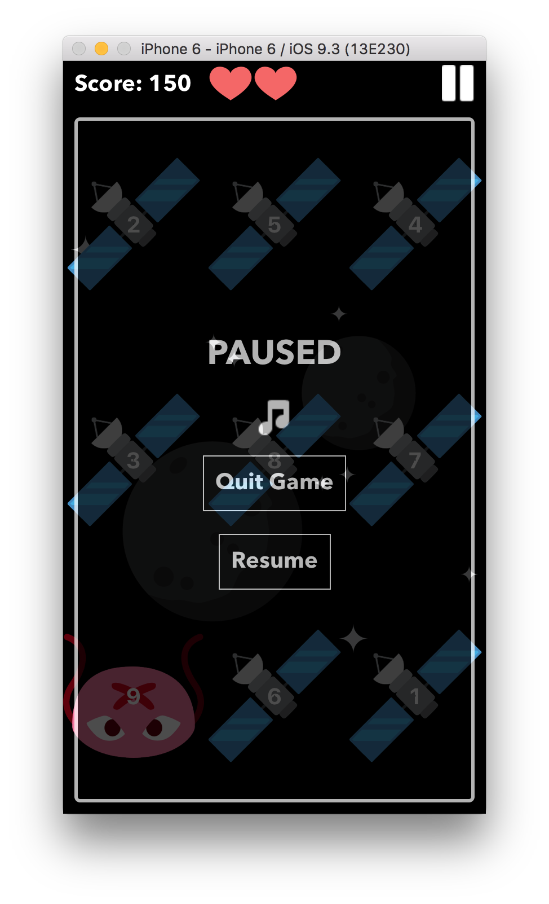

# spacewhack
A space-themed whack-a-mole game built in React Native.

## Contributing

* `npm install`
* `react-native run-ios` (using React Native [command-line tools](https://facebook.github.io/react-native/docs/getting-started.html))

## Credits

* Space background by [bevoulin](http://opengameart.org/content/bevouliin-free-space-background)
* Space monster, bomb, and heart images sourced and edited from [EmojiOne](http://emojione.com)
* Innocent bunny image by [Kathy](https://twitter.com/pifafu)
* Background music by [subdream](http://opengameart.org/content/space-philately-seamless-loop)
* Intro screen planet and asteroid images from [pudman](http://opengameart.org/content/2d-space-shooter-assets)
* Title font is [Plento](https://www.behance.net/gallery/37385151/PLENTO-Free-typeface)
